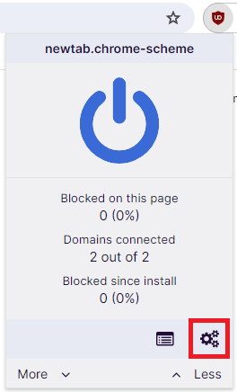

# uBlock-Origin-search-filter


My personal [uBlock Origin](https://ublockorigin.com) filter list which removes low-quality websites and nuisances from search engine results.

## Filters

This filter list removes the following from search engine results:

### Websites

- Stackoverflow mirrors
- GitHub mirrors
- Machine-generated comparisons

### Nuisances

- Google's "People also search for" box ([why?](https://webapps.stackexchange.com/questions/115038/how-to-stop-googles-people-also-search-for))

## Supported search engines:
- Google
- Bing
- Yahoo
- DuckDuckGo

## How to add this filter list to uBlock Origin

1. Open uBlock Origin's settings dashboard:



2. Go to Filter lists > Import...:


3. Paste this filter list's URL:

```
https://raw.githubusercontent.com/ardislu/uBlock-Origin-search-filter/release/search-filter.txt
```

4. Apply changes to uBlock Origin

## Similar projects
- [uBlacklist](https://iorate.github.io/ublacklist) and [awesome-ublacklist](https://github.com/rjaus/awesome-ublacklist)
- [only-stackoverflow](https://github.com/RyuaNerin/only-stackoverflow)
- [uBlock-Origin-dev-filter](https://github.com/quenhus/uBlock-Origin-dev-filter)
- [uBlock Origin - Shitty Copy-Paste websites filter](https://github.com/stroobants-dev/ublock-origin-shitty-copies-filter)
- [Filter Lists for uBlock Origin](https://github.com/MrBukLau/filter-lists-for-ublock-origin)
- [Google Hit Hider by Domain](https://greasyfork.org/en/scripts/1682-google-hit-hider-by-domain-search-filter-block-sites)
- [mig4ng/ublock-origin-filters](https://github.com/mig4ng/ublock-origin-filters)
- [Let's Block It!](https://github.com/letsblockit/letsblockit)
- [Unhook YouTube](https://unhook.app/)